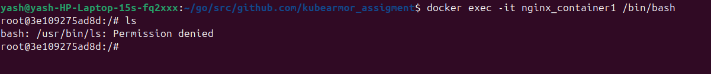

# Kubearmor Non-k8s Enhancement

## Setup KubeArmor in Unorchestrated mode on a BPF LSM node

- Download kubearmor package
```
curl https://github.com/kubearmor/KubeArmor/releases/download/v1.4.0/kubearmor_1.4.0_linux-amd64.deb
```
- Install kubearmor package
```
sudo apt --no-install-recommends install ./kubearmor_1.4.0_linux-amd64.deb
``` 
- Start kubearmor
```
sudo systemctl start kubearmor
``` 


- Install karmor cli
```
curl -sfL http://get.kubearmor.io/ | sudo sh -s -- -b /usr/local/bin
```


## Create a couple of containers using Docker on the same host
- Create two nginx containers 

```
docker run -d --name nginx_container1 -p 8081:80 nginx
docker run -d --name nginx_container2 -p 8081:80 nginx
```

## Apply these policies using karmor vm policy add and check   violations

```
make generatePolicy
```
- The policy will be generated in outpolicy folder

```
cd outpolicy

karmor vm policy add nginx-container1-policy.yaml
```




## Automatically call the function in your script to add all of these policies

```
make enforcePolicy
```
- This will enforce policy on the containers without using karmor CLI